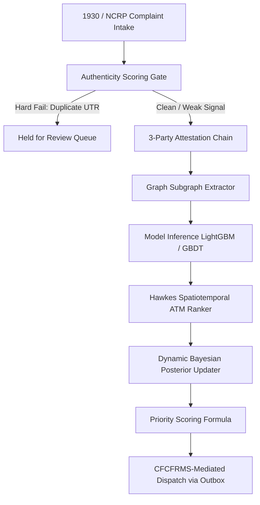

# Architecture

**Analysis Date:** 2026-09-24

## Pattern Overview

**Overall Pattern:** Dual-Mode Resilient Event Pipeline with Graceful Offline Fallback.

**Key Characteristics:**

- **Zero-Drop Resilience:** External dependencies (Neo4j, Hyperledger Fabric, CFCFRMS) are strictly isolated behind Circuit Breakers and durable SQLite outboxes.
- **Dual-Interface Adapters:** The offline demo implementation (`networkx`, SHA-256 hash chains) and production implementation (Neo4j, Fabric SDK) implement the exact same interface contract, enabling transparent auto-failover and offline evaluation.
- **Explainable Inference:** Combines fast GBDT feature scoring with a self-exciting Hawkes point process and closed-form Bayesian updates instead of opaque black-box deep learning.

## Pipeline Layers

### 1. Intake & Authenticity Gate Layer (`backend/app/services/authenticity.py`)

- Evaluates complaints before expensive graph or model computations.
- Gated checks:
  - UTR Duplication Check: Duplicate UTR hard-fails immediately to `HELD_FOR_REVIEW` ($score = 0.0$).
  - Serial Filer Heuristic: Complainants filing $>5$ times in 90 days incur a soft 5% deduction with explicit reason tracking.
  - Verification Weighting: Weights bank corroboration (0.45), OTP attestation (0.35), and history consistency (0.20).
- Decision States: `FORWARD_CLEAN`, `FORWARD_FLAGGED`, `HELD_FOR_REVIEW`.

### 2. Trust & Attestation Layer (`backend/app/adapters/ledger.py`)

- Enforces a 3-party cryptographic signature chain: Complainant (1/3) $\rightarrow$ Bank (2/3) $\rightarrow$ Police (3/3).
- Offline: SHA-256 linked blocks with hash verification (`verify_chain()`).
- Production: Fabric chaincode ledger.

### 3. Graph Intelligence Layer (`backend/app/adapters/graph_store.py`)

- Extracts k-hop subgraphs ($k \le 3$) strictly bounded to transfers occurring *after* the incident timestamp.
- Computes hub degree, hop velocity, and shared-device mule clusters.

### 4. Machine Learning & Hawkes Ranking (`backend/app/services/hawkes.py`, `ml/benchmark_models.py`)

- Evaluates probability of cash-out in the 15–45 min window.
- Ranks candidate ATMs using a Hawkes self-exciting intensity function:
  $$\lambda(t, \mathbf{x}) = \mu_0 + \sum_{t_i < t} \alpha \exp(-\beta (t - t_i)) \cdot \exp\left(-\frac{\|\mathbf{x} - \mathbf{x}_i\|^2}{2\sigma^2}\right)$$
- Prioritizes nearby, recent activity clusters over cold or distant locations.

### 5. Dynamic Bayesian Posterior Revision (`backend/app/services/bayesian_updater.py`)

- Updates prior probability as new bank-hop telemetry arrives:
  $$P(\text{Zone } k \mid E) \propto P(E \mid \text{Zone } k) \cdot P(\text{Zone } k)$$
- Implements exponential time decay ($T_{\text{decay}} = 45\text{ min}$): shifts state to `_missed` after prolonged silence.

### 6. Priority Scoring (`backend/app/services/priority.py`)

- Composite formula:
  $$\text{Priority} = \text{Risk} \times \text{Urgency} \times \text{Amount} \times \text{Confidence} \times \text{Actionability}$$

### 7. Resilient Dispatch (`backend/app/services/dispatch.py`, `backend/app/core/resilience.py`)

- Routes alerts to LEAs with Section 105 BNSS legal grounds.
- Durable SQLite outbox guarantees zero alert drop during network or webhook downtime.

*Architecture analysis: 2026-09-24*
